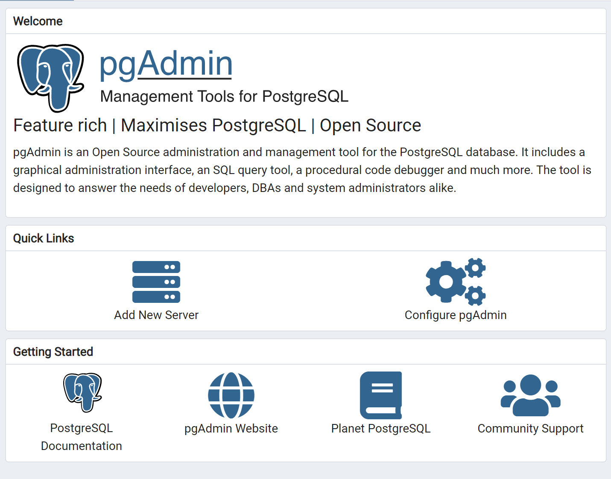
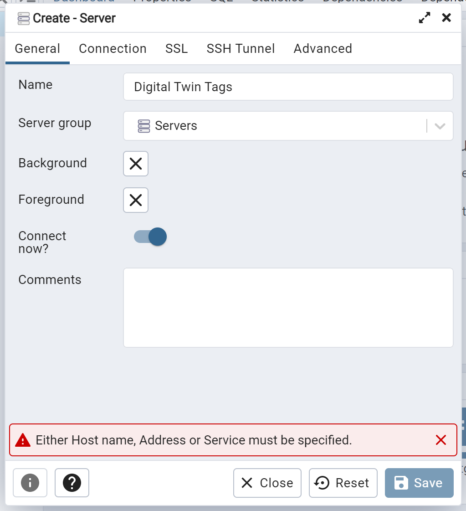
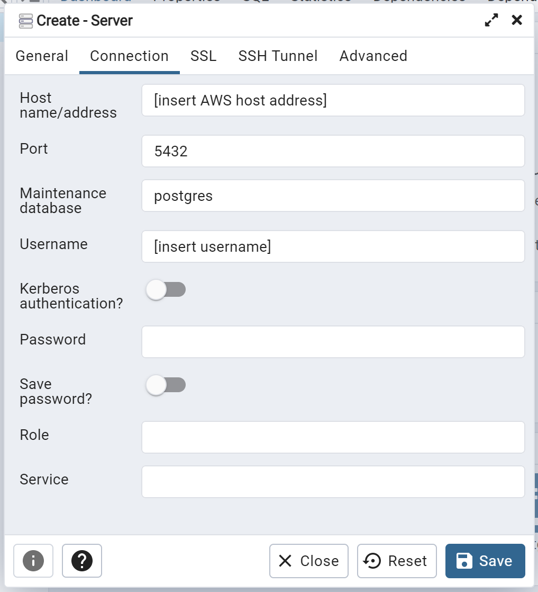
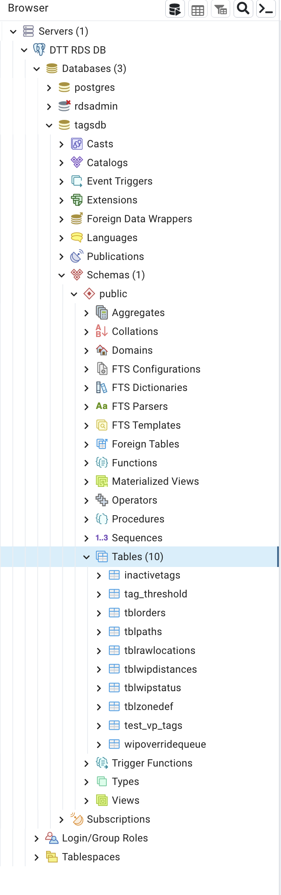
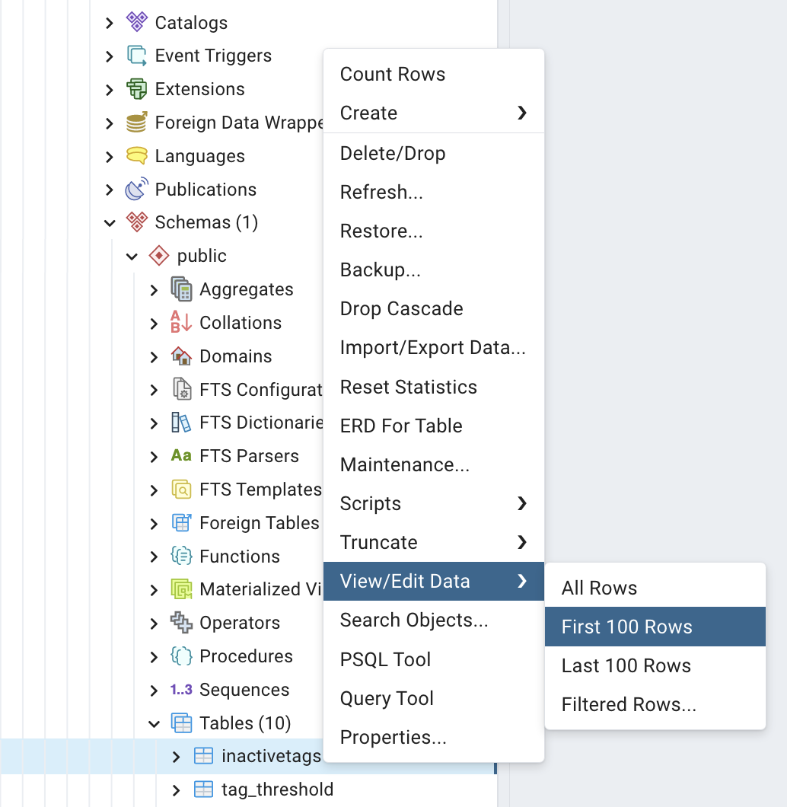

# Database

## database connection

Prerequisite: pgadmin4, AWS RDS database connection info

Follow the steps below to establish a database connection via pgadmin

When pgadmin is launch you are greeted with a similar welcome page. First click into "Add New Server"

Next a form will appear. You can name the database (it does not matter as this name will just be on your local machine to help define this database and any other databases you may have locally)

Next click into the "Connection" tab where you will add the host name, port number, username and password (you can toggle on the save password as to not require a database user password prompt on every connection)

***Note: Please reach out to the appropriate people if you need the AWS connection information (host name, port, username, password)***

Once you click save you should now have access to the database and can navigate to the different tables by following this directory structure.

You are able to query for information using the tool shown here once you right click into a table. For more specific queries you can use the "Query Tool" just above the "Properties..." to type specific SQL queries.

## File dbfuncs

Has all functions related to management of the database

### Connection Management
Deals with the connection of the backend to the database

`db_connection()`

`closeDBConnection(conn)`

### Initialization Functions
Functions ran upon initialization of database environment

`db_init(cursor)`

`define_hard_zones(cursor)`

### Delete Functions
Function used to delete data

`delete_all(cursor)` ***Note: This function should not be used unless needed. Will delete all tables and data within the database***

`deleteWIPOverrideFromQueue(cursor, WIP, QTY)`
Deletes a WIP from queue when front-end supervisor sets t_end to overridden WIP

`clearAllInactive(cursor)`
Clear all Inactive tags before populating it again in the poll
***Note: This function should be deprecated later. It is bad practice to completely clear the table as the front-end maybe querying for incomplete data. Instead during the poll it should check the 48 hour criteria and if a tag no longer satisfies it, the entry should be deleted and if a new tag satisfies the condition it should be added.***

### Insert Functions
Functions used to insert new data entries into the database

`dbPushTblWipDistances(cursor, WIP, QTY, x, y, distance)`

`dbPushTblOrders(cursor, WIP, QTY, tagID, inProd, t_start, t_end, time_on_floor, build_time, lastZone, zoneName)`

`dbPushTblPaths(cursor, WIP, QTY, tagID, zoneID, zoneName, time)`

`dbPushTblRawLocations(cursor, WIP, QTY, tagID, timestamp, x, y, zoneID)`

`dbPushZoneDef(cursor, ZoneName, x_lower, x_upper, y_lower, y_upper)`
Push a new zone definition. If the zone being pushed has a name that matches with a zone that is currently active, it will deactivate the previous zone. This will set a new entry with the updates attributes like coordinates.

`dbPushInactiveTags(cursor, tagID, WIP, QTY, inactive_duration)`

`addWIPOverrideIntoQueue(cursor, WIP, QTY)`

### Update Functions
Functions used to update existing data entries in the database

`dbUpdateTblWipDistances(cursor, WIP, QTY, x, y, distance)`

`dbUpdateWipStatus(cursor, WIP, QTY, tagID, timestamp, x, y, zoneID)`

`dbUpdateWIPOnTblPaths(cursor, WIP, QTY, zoneID)`

`setWIPInProd(cursor, WIP, QTY, inprod)`

`setProdEndTime(cursor, WIP, QTY, timestamp)`

`manualWIPOverrideForAllQTY(cursor, WIP, t_end)`

`manualWIPOverrideForQTY(cursor, WIP, QTY, t_end)`

`disableZoneDef(cursor, ZoneName)`

### Get Functions

`getDistance(cursor, wip, qty)`
Returns a tag lastX and lastY position and the total distance that specific object has travelled previously.

`getActiveTimes(cursor)`
***Deprecated Function*** Gathered actives times to determine threshold based on 5 minute polling.
Threshold is then used to determine if the production floor is active or not.

`getActiveZones(cursor)`
Returns all the active set zones

`getActiveTagZones(cursor, x, y)`

`getZoneName(cursor, ZoneID)`

`getLastInProdWIPBasedOnTagId(cursor, tagid)`

`getLastInProdBasedOnTagIdExt(cursor, tagid)`

`getAllWIPOverride(cursor)`

`getInactiveInProdTags(cursor)`